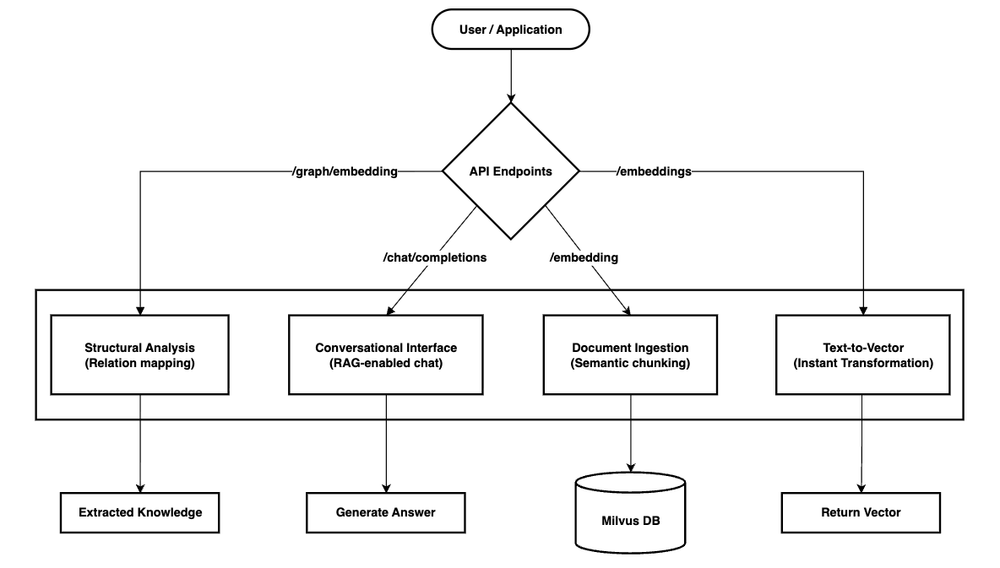

# 🚀 Your Agent: Universal Multimodal RAG Engine

This project is a high-performance, **multi-modal Retrieval-Augmented Generation (RAG)** framework. By integrating **vLLM** for rapid inference and **Milvus** for vector storage, it processes both text and images to deliver grounded, context-aware intelligence.

<p align="center">

<a href="https://opensource.org/licenses/BSD-3-Clause">

</a>
<a href="https://github.com/famppy-dev/your-agent">

</a>
</p>

---

## ✨ Key Features

- **Model-Agnostic (Flexible Switching):** Swap the rapidly evolving AI models via environment variables.
- **Multi-modal RAG (Vision-Text Integration):** Captions and indexes document images using VLM, transforming visual data into searchable text assets.
- **High-Performance Inference:** Delivers low-latency responses and high throughput powered by the vLLM Async Engine.
- **Advanced Data Pipeline:** Implements Semantic Chunking and Reranker to ensure that only the most relevant context reaches the LLM.
- **Graph-RAG Capabilities (Structural Intelligence):** Supports structured relational search by extracting Entities and Relationships from raw text.

---

## 🏗️ System Architecture



---

## ⚙️ Quick Start

### 0. Requirements

- **GPU:** NVIDIA Ampere or later (e.g., RTX 3090, 4090, A100, H100, etc.)
- **NVIDIA driver:** compatible with CUDA 12.4
- **NVIDIA Container Toolkit**
- **Docker & Docker Compose**

### 1. Launch with Docker

The simplest way to launch the entire stack at once.

```bash
# 1. Setup environment variables
cp .env .env-prod

# 2. Update the following variables in .env-prod to match your setup:
LLM_MODEL=your_main_llm_name
VLM_MODEL=your_vision_llm_name
EMBED_MODEL=your_text_embedding_model
EMBED_IMG_MODEL=your_vision_embedding_model
EMBED_RERANK_MODEL=your_reranker_model

# 3. launch all services
docker compose up -d

```

### 2. Milvus Access Information

- **Milvus Admin:** `http://localhost:8080/`
- **Credentials:** ID: `root` / PW: `Milvus`
- **Note:** Create a **Role** first before adding a new **User** in the Admin UI.

---

## 📖 API Usage Guide

### Basic call (OpenAI Compatible)

Setting `is_rag: True` enables the agent to reference uploaded documents for its response.

```python
import json
import requests

with requests.post("http://localhost:8000/v1/chat/completions", json={
    "model": "local",
    "messages": [
        {
            "role": "user",
            "content": msg,
        }
    ]
}, headers={"Content-Type": "application/json"}, stream=stream) as response:
    response.raise_for_status()
    result = response.json()
    full_text = result["choices"][0]["message"]["content"]
    print(f"Result:\n{full_text}\n\nUsage:\n\n{result['usage']}")

```

### Basic call for embedding text

Converts input text into an embedding vector.

```python
import requests

with requests.post("http://localhost:8000/v1/embedding", json={"model": "local", "input": msg}, headers={"Content-Type": "application/json"}) as response:
    response.raise_for_status()
    result = response.json()
    print(result)

```

### Basic call for embedding files

Adds documents (e.g., PDFs) to the system's knowledge base.

```python
import requests

with open("sample.pdf", "rb") as f:
    files = {"file": f}

    with requests.post("http://localhost:8000/v1/rag/embedding", files=files) as response:
        response.raise_for_status()

        result = response.json()

        if result["result"] == 200:
            print(f"Result: \n{result['data']}")
        else:
            print(f"Result: \n{result['error']}")

```

### Basic call for Retrieval

Retrieval in the system's knowledge base.

```python
import json
import requests

url = "http://localhost:8000/v1/chat/completions"
headers = {"Content-Type": "application/json"}
data = {
    "model": "local",
    "messages": [
        {
            "role": "user",
            "content": msg,
        }
    ],
    "is_rag": True,
}

with requests.post(url, json=data, headers=headers, stream=stream) as response:
    response.raise_for_status()
    result = response.json()
    full_text = result["choices"][0]["message"]["content"]
    print(f"Result:\n{full_text}\n\nUsage:\n\n{result['usage']}")

```

---

## 📁 Project Directory Structure

```text
your-agent/
├── server/
│   ├── routers/
│   ├── llm/
│   │   ├── vllm.py         # vLLM-based inference engine
│   │   └── prompts/        # prompt management
│   ├── middleware/         # Authentication and logging processing system
│   ├── models/             # Data and response schema definitions
│   ├── db/
│   ├── embedding/
│   ├── docs/
│   └── server.py
├── docker-compose.yaml     # Backend infrastructure integrated management
├── pyproject.toml          # uv-based dependency management
├── start.sh                # System integration execution
└── README.md

```
